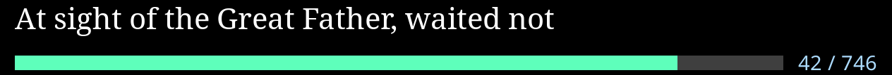
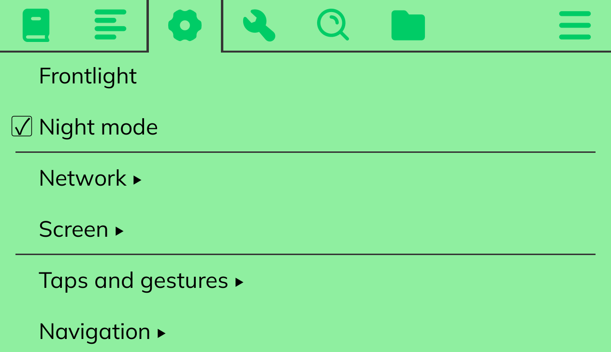
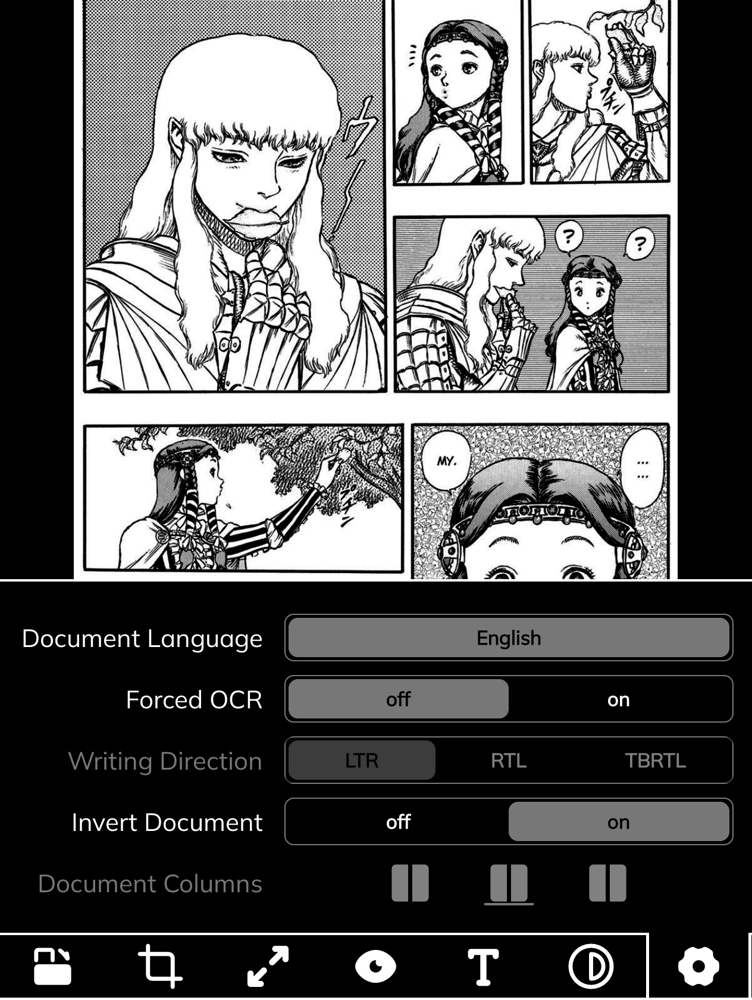
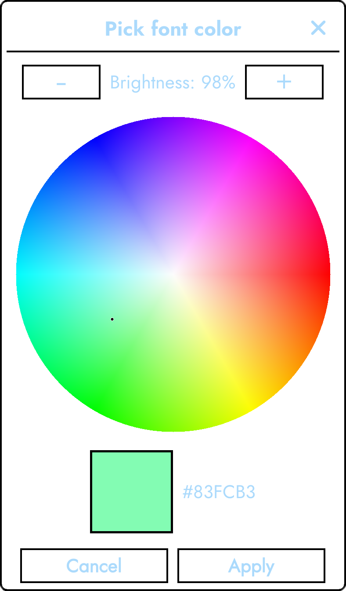

# KOReader.patches

Useful patches for KOReader that I have either compiled, edited, or created myself.

### [🞂 2-turn-off-frontlight-during-refresh.lua](2-turn-off-frontlight-during-refresh.lua)
This patch removes the frontlight during refreshes in night mode.
Based on [this post by LexamusPrime](https://www.reddit.com/r/koreader/comments/1q9g37j/keep_dark_mode_dark).

It can be configured under **🞂 Screen 🞂 Frontlight refresh** on the  **Settings** tab.

### [🞂 2-filemanager-next-prev-page-actions.lua](2-filemanager-next-prev-page-actions.lua)
This patch adds dispatcher actions (assignable to gestures) for going to the next or previous page in filemanager.

Made for [kobo.koplugin](https://github.com/OGKevin/kobo.koplugin).

### [🞂 2-progress-bar-color.lua](2-progress-bar-color.lua)
This patch adds the ability to change the RGB color of the reader progress bar.

It can be configured under **🞂 Status bar 🞂 Progress bar 🞂 Thickness, height & colors:** on the  **Settings** tab.

It adds four menu options: read color, unread color, and toggles to invert each in night mode.

This version specifically adds the following features:
- Night mode color correction (the same colors even in night mode)
- Setting persistence (the colors stay the same even after restarts)

Optionally, it supports [colorwheelwidget.lua](#-colorwheelwidgetlua), allowing the colors to be picked visually.

Based on [2-customise-progress-bar-colour-gui.lua](https://gist.github.com/IntrovertedMage/6ea38091292310241ba436f930ee0cb4) by [IntrovertedMage](https://github.com/IntrovertedMage).

### [🞂 2-ui-font-color.lua](2-ui-font-color.lua)
This patch adds the ability to change the RGB color of the UI font.

It can be configured under **🞂 UI font color:** on the  **Settings** tab.

It has options for the color, a toggle to invert it in night mode, a toggle for TextBoxWidgets (affects CoverBrowser), and a toggle for dictionary text.

Optionally, it supports [colorwheelwidget.lua](#-colorwheelwidgetlua), allowing the color to be picked visually.

### [🞂 2-ui-background-color.lua](2-ui-background-color.lua)
This patch adds the ability to change the RGB color of the UI background.

It is most recommended for non-e-ink devices for visiblity and refresh clarity, but it works fine on color e-ink (and B/W e-ink for selecting shades of gray). It is also best used together with [2-ui-font-color.lua](#-2-ui-font-colorlua) for best contrast.

It can be configured under **🞂 UI background color:** on the  **Settings** tab.

It has options for the color, a toggle to invert it in night mode, a toggle for TextBoxWidgets (affects CoverBrowser), a toggle to change the page background color, and a toggle for the ReaderFooter.

Optionally, it supports [colorwheelwidget.lua](#-colorwheelwidgetlua), allowing the color to be picked visually.

### [🞂 2-invert-document.lua](2-invert-document.lua)
This patch adds a document option to invert CBZs/PDFs in night mode.
It is useful for reading comics/manga in night mode.

Made for koreader/koreader#9899.

## Widgets

Widgets allow for additional functionality for patches. Developers use them to provide unique ways to configure options.

### *How do I install widgets?*
You can install widgets by downloading the file and placing it in `koreader/frontend/ui/widget`.

### [🞂 colorwheelwidget.lua](widgets/colorwheelwidget.lua)

Adds a visual color wheel for selecting colors. It can be used with numerous different options.

The options are:
- `title_text`
- `width`
- `width_factor`
- `hue`
- `saturation`
- `value`
- `invert_in_night_mode`
- `cancel_text`
- `apply_text`

