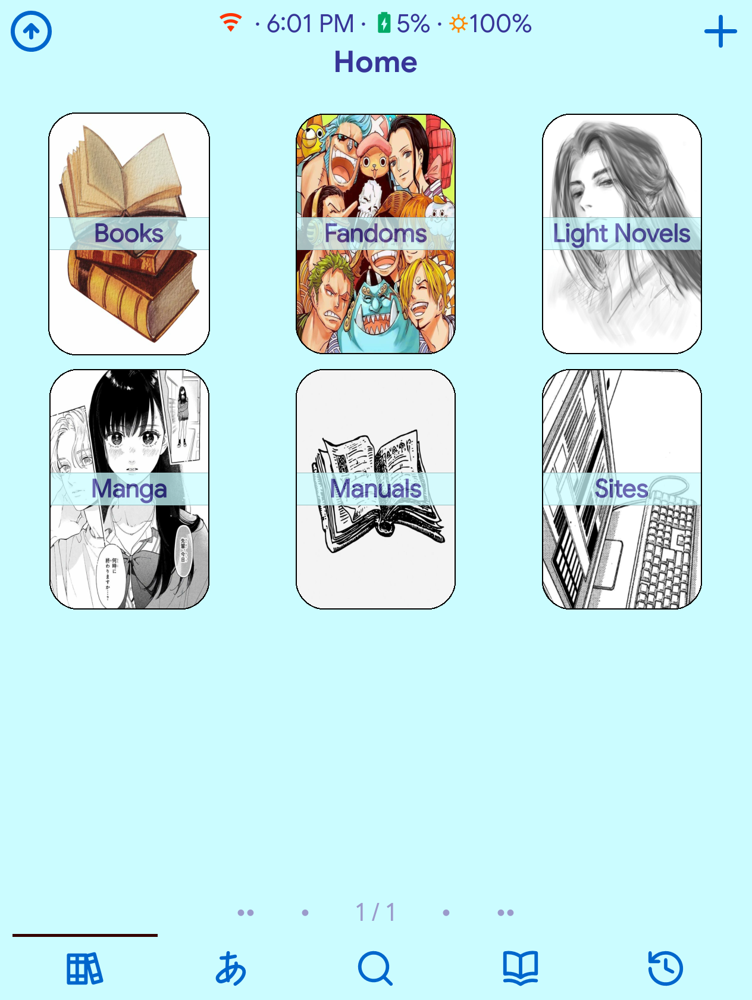
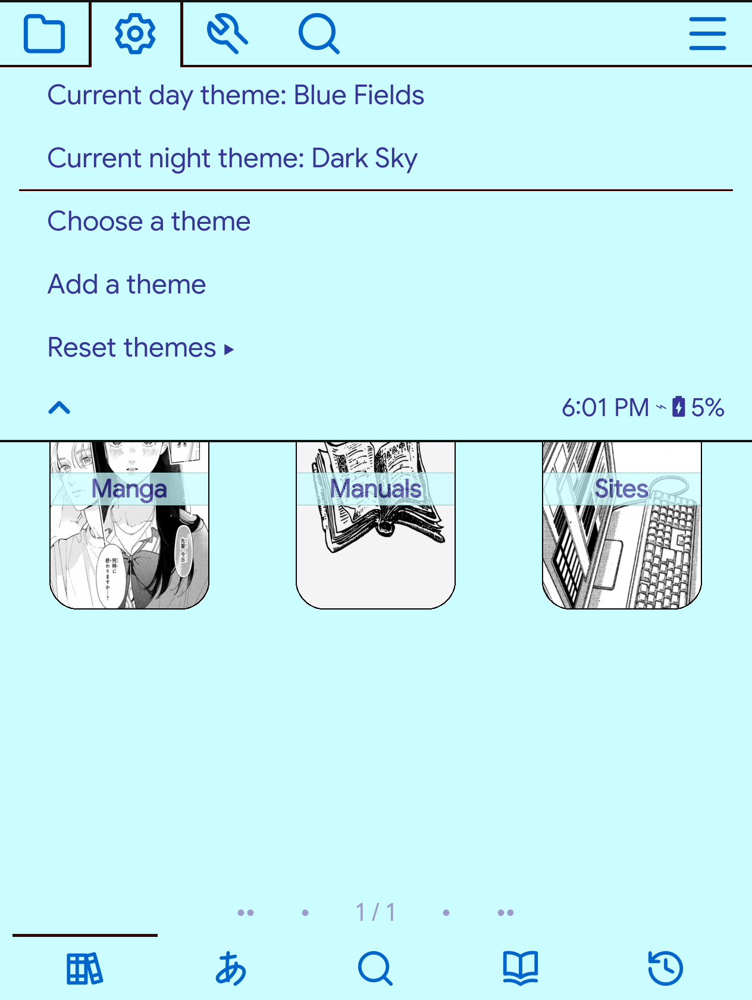
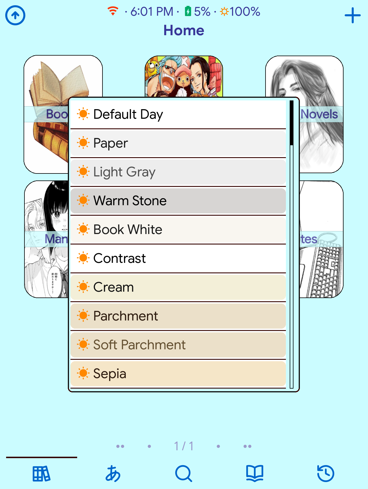
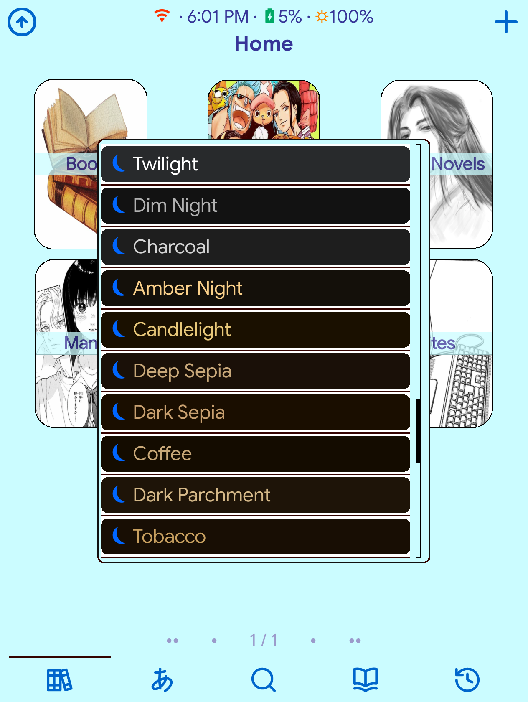
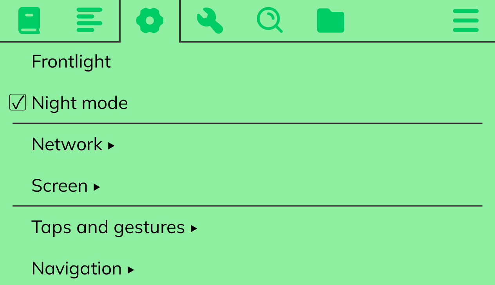
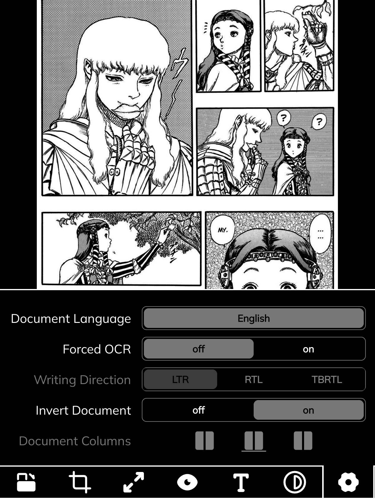
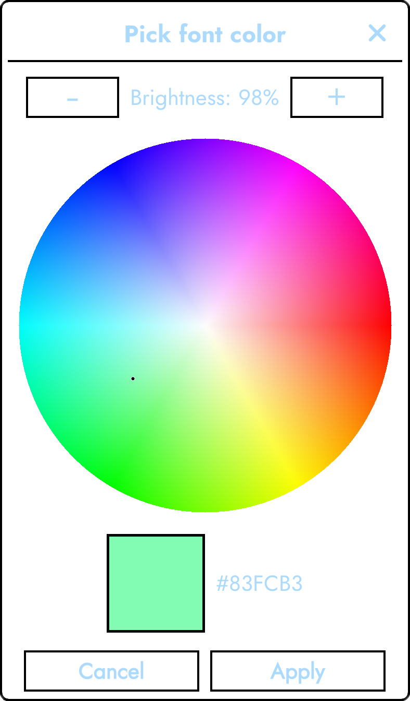

# KOReader.patches

Useful patches for KOReader that I have either compiled, edited, or created myself.

### [🞂 2-dim-during-refresh.lua](2-dim-during-refresh.lua)
This patch lowers the brightness during refreshes in night mode to prevent bright flashes.
Based on [this post by LexamusPrime](https://www.reddit.com/r/koreader/comments/1q9g37j/keep_dark_mode_dark).

It can be configured under **🞂 Screen 🞂 Dim frontlight on refreshes** on the  **Settings** tab.

It has the following options:
- A toggle to enable dimming.
- A toggle to force dimming every page turn/refresh.
- A toggle for dimming on UI refreshes.
- A toggle for dimming in the reader only.
- A toggle to dim relative to the current brightness.
- A numeric stepper for the level of dimming (absolute/relative).

### [🞂 2-filemanager-next-prev-page-actions.lua](2-filemanager-next-prev-page-actions.lua)
This patch adds dispatcher actions (assignable to gestures) for going to the next or previous page in filemanager.

Made for [kobo.koplugin](https://github.com/OGKevin/kobo.koplugin).

### [🞂 2-progress-bar-color.lua](2-progress-bar-color.lua)
This patch adds the ability to change the RGB color of the reader progress bar.

It can be configured under **🞂 Status bar 🞂 Progress bar 🞂 Thickness, height & colors:** on the  **Settings** tab.

It adds four menu options: read color, unread color, and toggles to invert each in night mode.

This version specifically adds the following features:
- Night mode color correction (the same colors even in night mode)
- Setting persistence (the colors stay the same even after restarts)

Optionally, it supports [colorwheelwidget.lua](#-colorwheelwidgetlua), allowing the colors to be picked visually.

Based on [2-customise-progress-bar-colour-gui.lua](https://gist.github.com/IntrovertedMage/6ea38091292310241ba436f930ee0cb4) by [IntrovertedMage](https://github.com/IntrovertedMage).

### [🞂 2-ui-themes.lua](2-ui-themes.lua)
> [!IMPORTANT]
> The visual theme picker and edit menu depend on features from the latest nightly of KOReader.
> You can either update to the nightly or wait for the next release for full functionality.
> For the foreground color to be previewed properly, inline markup colors must be enabled in the [UI font color patch](#-2-ui-font-colorlua).

This patch adds the ability to set themes for the UI background and font colors.

It requires [2-ui-font-color.lua](#-2-ui-font-colorlua) & [2-ui-background-color.lua](#-2-ui-background-colorlua).

It can be configured under **🞂 Appearance 🞂 Themes** on the  **Settings** tab.

Themes can be previewed when choosing them. Themes can also be edited by holding down on them when in the visual theme picker.

Optionally, it supports [colorwheelwidget.lua](#-colorwheelwidgetlua), allowing the colors to be picked visually.

Inspired by [2-color-theme.lua](https://github.com/artemartemenko/koreader-color-themes) from [@artemartemenko](https://github.com/artemartemenko).

### [🞂 2-ui-font-color.lua](2-ui-font-color.lua)
This patch adds the ability to change the RGB color of the UI font.

It also adds inline markup color support to UI text with the following syntax:

> **§color** text **§r**

The color can be addressed by either name (white) or RGB hex (#ffffff or #fff).
This can be useful for when you want parts of text or icons to be a certain color (such as in a titlebar patch).

It can be configured under **🞂 Appearance 🞂 Font color:** on the  **Settings** tab.

Besides the color, it has options for:
- A toggle to use an alternative color in night mode.
- A toggle to invert it in night mode.
- A toggle for TextBoxWidgets (which affects CoverBrowser).
- A toggle for the dictionary text.
- A toggle to change the page font color. (epub, html, fb2, txt...)
- A toggle to change the color only in the reader.
- A toggle for markup colors.
- A toggle to invert inline markup colors in night mode.

Optionally, it supports [colorwheelwidget.lua](#-colorwheelwidgetlua), allowing the color to be picked visually.

### [🞂 2-ui-background-color.lua](2-ui-background-color.lua)
This patch adds the ability to change the RGB color of the UI background.

It is most recommended for non-e-ink devices for visiblity and refresh clarity, but it works fine on color e-ink (and B/W e-ink for selecting shades of gray). It is also best used together with [2-ui-font-color.lua](#-2-ui-font-colorlua) for best contrast.

It can be configured under **🞂 Appearance 🞂 Background color:** on the  **Settings** tab.

Besides the color, it has options for:
- A toggle to use an alternative color in night mode.
- A toggle to invert it in night mode.
- A toggle for TextBoxWidgets (which affects CoverBrowser).
- A toggle to change the page background color. (epub, html, fb2, txt...)
- A toggle for the reader footer.
- A toggle for the reader sides.
- A toggle for the page gaps.

Optionally, it supports [colorwheelwidget.lua](#-colorwheelwidgetlua), allowing the color to be picked visually.

### [🞂 2-invert-document.lua](2-invert-document.lua)

> [!WARNING]
> This patch is now obsolete as of the newest nightly (v2025.10-182+) with koreader/koreader#14954.
> It should be removed when updating to the nightly or new releases.

This patch adds a document option to invert CBZs/PDFs in night mode.
It is useful for reading comics/manga in night mode.

Made for koreader/koreader#9899.

### [🞂 2-correct-screen-borders.lua](2-correct-screen-borders.lua)
This patch adds border lines to the sides of the screen to correct for e-ink issues.
Made for [this post by wigglytoad](https://www.reddit.com/r/koreader/comments/1r7l5co/request_patch_to_remove_1pixelwide_vertical_white/).

It can be configured under **🞂 Screen 🞂 Border correction** on the  **Settings** tab.

### [🞂 2-percent-badge.lua](2-percent-badge.lua)
This patch adds a customizable badge that displays the percentage read for each book. It also displays whether a book has been completed or paused.

It has inline option variables at the start of the file.

In comparison to the original, it adds two new additional features:
- The ability to not be inverted in night mode when used together with the [UI background color patch](#-2-ui-background-colorlua).
- The inline option to exclude the text color from being modified by the [UI font color patch](#-2-ui-font-colorlua).

Edited from [the version by angelsangita](https://github.com/angelsangita/Koreader-Patches?tab=readme-ov-file#-2-percent-badge).

### [🞂 2-rounded-covers.lua](2-rounded-covers.lua)
This patch adds rounded corners to the book covers in the file browser.

The core feature that distinguishes this version is that it is background-agnostic, meaning that it works on any background without requiring any corner icons. Due to that, this patch works well with the [UI background color patch](#-2-ui-background-colorlua).

Based on the [original patch by SeriousHornet](https://github.com/SeriousHornet/KOReader.patches?tab=readme-ov-file#-2--rounded-coverslua).

### [🞂 2-rounded-folder-covers.lua](2-rounded-folder-covers.lua)
This patch adds rounded corners to the folder covers in the file browser.

The core feature that distinguishes this version is that it is background-agnostic, meaning that it works on any background without requiring any corner icons. Due to that, this patch works well with the [UI background color patch](#-2-ui-background-colorlua).

Based on the [original patch by SeriousHornet](https://github.com/SeriousHornet/KOReader.patches?tab=readme-ov-file#-2-rounded-folder-coverslua).

### [🞂 2-custom-widgets.lua](2-custom-widgets.lua)
This patch adds support for custom widgets that can be used by other patches and plugins.

Widgets are auto-loaded from: `<koreader_dir>/widgets/`

Each .lua file in that directory is loaded and registered under its
filename (without the .lua extension). For example:
    widgets/colorwheelwidget.lua  →  "colorwheelwidget"

Information on how to use it in patches/plugins can be found in the patch comments.

## Widgets

Widgets allow for additional functionality for patches. Developers use them to provide unique ways to configure options.

### *How do I install widgets?*
You can install widgets by using the [custom widgets patch](#-2-custom-widgetslua). After installing that patch, you have to create a custom `widgets` folder (just like the `patches` folder) inside of the `koreader directory`. Any widgets can now be placed inside this new `widgets` folder.

### [🞂 colorwheelwidget.lua](widgets/colorwheelwidget.lua)

Adds a visual color wheel for selecting colors. It can be used with numerous different options.

The options are:
- `title_text`
- `width`
- `width_factor`
- `hue`
- `saturation`
- `value`
- `invert_in_night_mode`
- `draw_scale`
- `cancel_text`
- `apply_text`

